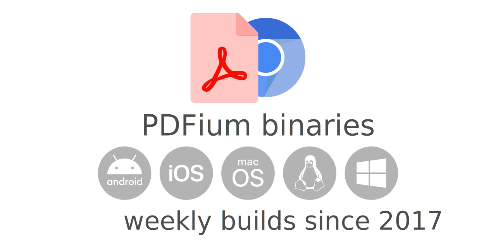

<p align="center">
  
</p>

# Pre-compiled binaries of PDFium

[](https://github.com/bblanchon/pdfium-binaries/actions/workflows/build.yml)
[](https://github.com/bblanchon/pdfium-binaries/releases/)
[](https://github.com/bblanchon/pdfium-binaries/releases/latest/)
[](https://www.nuget.org/packages/bblanchon.PDFium/)

This project hosts pre-compiled binaries of the [PDFium library](https://pdfium.googlesource.com/pdfium/), an open-source library for PDF manipulation and rendering.

Builds are triggered automatically every Monday since 2017.

**Disclaimer**: This project isn't affiliated with Google or Foxit.

## Download

Here are the download links for latest release:

<table>
  <tr>
    <th>OS</th>
    <th>CPU</th>
    <th>PDFium</th>
  </tr>

  <tr>
    <td rowspan="4">Android</td>
    <td>arm</td>
    <td><a href="https://github.com/bblanchon/pdfium-binaries/releases/latest/download/pdfium-android-arm.tgz">pdfium-android-arm.tgz</a></td>
  </tr>
  <tr>
    <td>arm64</td>
    <td><a href="https://github.com/bblanchon/pdfium-binaries/releases/latest/download/pdfium-android-arm64.tgz">pdfium-android-arm64.tgz</a></td>
  </tr>
  <tr>
    <td>x64</td>
    <td><a href="https://github.com/bblanchon/pdfium-binaries/releases/latest/download/pdfium-android-x64.tgz">pdfium-android-x64.tgz</a></td>
  </tr>
  <tr>
    <td>x86</td>
    <td><a href="https://github.com/bblanchon/pdfium-binaries/releases/latest/download/pdfium-android-x86.tgz">pdfium-android-x86.tgz</a></td>
  </tr>

  <tr>
    <td rowspan="2">iOS</td>
    <td>arm64</td>
    <td><a href="https://github.com/bblanchon/pdfium-binaries/releases/latest/download/pdfium-ios-arm64.tgz">pdfium-ios-arm64.tgz</a></td>
  </tr>
  <tr>
    <td>x64</td>
    <td><a href="https://github.com/bblanchon/pdfium-binaries/releases/latest/download/pdfium-ios-x64.tgz">pdfium-ios-x64.tgz</a></td>
  </tr>

  <tr>
    <td rowspan="4">Linux</td>
    <td>arm</td>
    <td><a href="https://github.com/bblanchon/pdfium-binaries/releases/latest/download/pdfium-linux-arm.tgz">pdfium-linux-arm.tgz</a></td>
  </tr>
  <tr>
    <td>arm64</td>
    <td><a href="https://github.com/bblanchon/pdfium-binaries/releases/latest/download/pdfium-linux-arm64.tgz">pdfium-linux-arm64.tgz</a></td>
  </tr>
  <tr>
    <td>x64</td>
    <td><a href="https://github.com/bblanchon/pdfium-binaries/releases/latest/download/pdfium-linux-x64.tgz">pdfium-linux-x64.tgz</a></td>
  </tr>
  <tr>
    <td>x86</td>
    <td><a href="https://github.com/bblanchon/pdfium-binaries/releases/latest/download/pdfium-linux-x86.tgz">pdfium-linux-x86.tgz</a></td>
  </tr>

  <tr>
    <td rowspan="2">macOS</td>
    <td>arm64</td>
    <td><a href="https://github.com/bblanchon/pdfium-binaries/releases/latest/download/pdfium-mac-arm64.tgz">pdfium-mac-arm64.tgz</a></td>
  </tr>
  <tr>
    <td>x64</td>
    <td><a href="https://github.com/bblanchon/pdfium-binaries/releases/latest/download/pdfium-mac-x64.tgz">pdfium-mac-x64.tgz</a></td>
  </tr>

  <tr>
    <td rowspan="3">Windows</td>
    <td>arm64</td>
    <td><a href="https://github.com/bblanchon/pdfium-binaries/releases/latest/download/pdfium-win-arm64.tgz">pdfium-win-arm64.tgz</a></td>
  </tr>
  <tr>
    <td>x64</td>
    <td><a href="https://github.com/bblanchon/pdfium-binaries/releases/latest/download/pdfium-win-x64.tgz">pdfium-win-x64.tgz</a></td>
  </tr>
  <tr>
    <td>x86</td>
    <td><a href="https://github.com/bblanchon/pdfium-binaries/releases/latest/download/pdfium-win-x86.tgz">pdfium-win-x86.tgz</a></td>
  </tr>

  <tr>
    <td colspan="2">WebAssembly<sup>1</sup></td>
    <td><a href="https://github.com/bblanchon/pdfium-binaries/releases/latest/download/pdfium-wasm.tgz">pdfium-wasm.tgz</a></td>
  </tr>
</table>

<small>1: WebAssembly build is experimental; please [provide feedback](https://github.com/bblanchon/pdfium-binaries/issues/28).</small>

See the [Releases page](https://github.com/bblanchon/pdfium-binaries/releases) to download older versions of PDFium.

### NuGet Packages

The following NuGet packages are available:

<table>
  <tr>
    <th>OS</th>
    <th>NuGet package</th>
  </tr>

  <tr>
    <td>All (meta package)</td>
    <td><a href="https://www.nuget.org/packages/bblanchon.PDFium/">bblanchon.PDFium</a></td>
  </tr>

  <tr>
    <td>Android</td>
    <td><a href="https://www.nuget.org/packages/bblanchon.PDFium.Android/">bblanchon.PDFium.Android</a></td>
  </tr>

  <tr>
    <td>iOS</td>
    <td><a href="https://www.nuget.org/packages/bblanchon.PDFium.iOS/">bblanchon.PDFium.iOS</a></td>
  </tr>

  <tr>
    <td>Linux</td>
    <td><a href="https://www.nuget.org/packages/bblanchon.PDFium.Linux/">bblanchon.PDFium.Linux</a></td>
  </tr>

  <tr>
    <td>macOS</td>
    <td><a href="https://www.nuget.org/packages/bblanchon.PDFium.macOS/">bblanchon.PDFium.macOS</a></td>
  </tr>

  <tr>
    <td>Windows</td>
    <td><a href="https://www.nuget.org/packages/bblanchon.PDFium.Win32/">bblanchon.PDFium.Win32</a></td>
  </tr>
</table>

**HELP WANTED!**  
I can provide packages for your favorite package manager, but I need help from someone who knows the format. Contact me via the [GitHub issues](https://github.com/bblanchon/pdfium-binaries/issues) if you wanna help.

## Documentation

### PDFium API documentation

Please find the [documentation of the PDFium API on developers.foxit.com](https://developers.foxit.com/resources/pdf-sdk/c_api_reference_pdfium/index.html).

### How to use PDFium in a CMake project

1. Unzip the dpwnloaded package in a folder (e.g., `C:\Libraries\pdfium`)
2. Set the environment variable `PDFium_DIR` to this folder (eg `C:\Libraries\pdfium`)
3. In your `CMakeLists.txt`, add

        find_package(PDFium)

4. Then link your executable with PDFium:

        target_link_libraries(my_exe pdfium)

5. On Windows, make sure that `pdfium.dll` can be found by your executable (copy it on the same folder, or put in on the `PATH`).

### How to use JavaScript V8 enabled binaries

If you are using the V8-enabled binaries, additional initialization is required.
In your code, before using PDFium you have to call `FPDF_InitEmbeddedLibraries()`
from the additional header `fpdf_libs.h`, which is only available in V8 enabled
binaries.

The archive will contain a `res` folder which you have to distribute with your
application. On macOS, you should include this in your application bundle for other
platforms place it where your application binary will find it.

See the following example for usage:

```c++
#include "fpdf_libs.h"

...

// Determine the path to files in the res folder from the archive
const char* resPath = "<path to the res folder>";

// Initialize V8 and other embedded libraries
FPDF_InitEmbeddedLibraries(resPath);

// Make use of PDFium
FPDF_InitLibrary();
FPDF_DestroyLibrary();
```

### How to create macOS universal binary

To  create a universal macOS binary containing both Intel and ARM code, download
both CPU versions and use the `mac_create_universal.sh` script to create a
universal archive.


## Related projects

The following project use (or recommend using) our PDFium builds:

* [dart_pdf](https://github.com/DavBfr/dart_pdf), PDF creation module for dart/flutter
* [Flutter native_pdf_renderer](https://github.com/rbcprolabs/packages.flutter/tree/master/packages/native_pdf_renderer), Flutter Plugin to render PDF pages as images
* [go-pdfium](https://github.com/klippa-app/go-pdfium), a Go wrapper around PDFium with helper functions for various methods like image rendering and text extraction
* [PDFium RS](https://github.com/asafigan/pdfium_rs), a Rust wrapper around PDFium
* [PDFiumCore](https://github.com/Dtronix/PDFiumCore), .NET Standard P/Invoke bindings for PDFium
* [PDFtoImage](https://github.com/sungaila/PDFtoImage), .NET library to render PDF content into images
* [PyPDFium2](https://github.com/pypdfium2-team/pypdfium2), Python bindings to PDFium
* [wxPDFView](https://github.com/TcT2k/wxPDFView), wxWidgets components to display PDF content

*Did we miss a project? Please open a PR!*  


## Contributors

David Sungaila, [@sungaila](https://github.com/sungaila):

* NuGet packages

Christoffer Green, [@ChristofferGreen](https://github.com/ChristofferGreen):

* Linux ARM build

Tobias Taschner, [@TcT2k](https://github.com/TcT2k):

* macOS build
* V8 build
